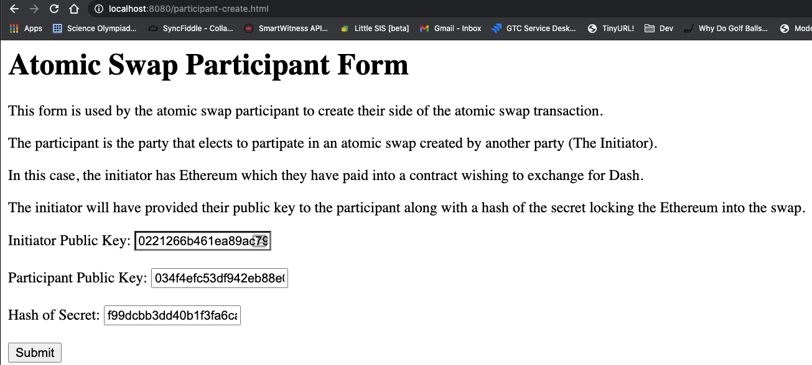
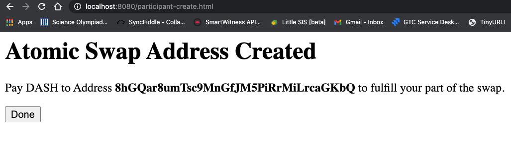
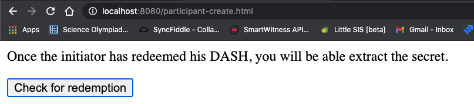
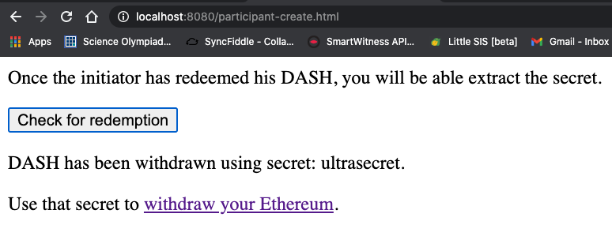

<style>
    img {
        margin-left: 5em;
        width: 60%;
        padding: 2em
    }
</style>

# dash-atomic-swap

Library for creating atomic swaps transactions on the Dash blockchain

---
# Demo Application

This repository contains a simple demo application is the `/demo` directory. In this appication the initiator has Ethereum they would like to swap for Dash. 

## Starting the Demo Application

1. 
    ```
    npm install
   ```

1.
    ```
    npm run server
    ```

1. Start [local Dash Node](#local-dash-node)    

Demo app will them be available at http://localhost:8080/

# Running the Demo Application

## Prerequisites

1. Ethereum

     In this demo application, Ethereum is being swapped for Dash, so the application also communicates with an Ethereum blockchain. In this case, a smart contract that has been deployed to to the Ropsten test network. In order to use the demo app, you will need to interact with the Ropsten network via MetaMask.

    1. Install [MetaMask](https://metamask.io/)

    1. Create Ethereum Accounts

        Each party to the swap (initiator and participant) will need accounts on the Ethereum blockchain (ropsten)

        

    2. Fund Initiator account

        The initiator needs some Ether to swap for Dash, so their account will need to have some ether to swap. Copy the initiators address from metamask and go to the [Ropsten faucet](https://faucet.ropsten.be/) to get some ether.

   


1. Local DASH Network

    The demo application connects to a local Dash node in [regtest mode](https://dashcore.readme.io/docs/core-examples-testing-applications#regtest-mode). 

    1. Start your [local dash node](#local-dash-node)

    1. If this is the first time starting the node, you will need to initialize the blockchain so that funds are available.

        ```
        dash-cli -regtest generate 101
        ```

    1. Generate DASH addresses and keys for the two parties in the swap.

        * The initiator

            1. Generate an address to receive the funds.

                ```    
                $ ./dash-cli -regtest getnewaddress

                yYu94PDiVRfpShg6pHrtQuPQT7fMno4eir
                ```

            2. Get the public key for this address

                ```
                ./dash-cli -regtest validateaddress yYu94PDiVRfpShg6pHrtQuPQT7fMno4eir

                {
                  "isvalid": true,
                  "address": "yYu94PDiVRfpShg6pHrtQuPQT7fMno4eir",
                  "scriptPubKey": "76a9148a00cd4114044918a5e9a53233a75b1c96a76d0488ac",
                  "ismine": true,
                  "iswatchonly": false,
                  "isscript": false,
                  "pubkey": "0221266b461ea89ac79e281769f4ba58e4f07c99ce83ce889d7b6c5795141aaf8c",
                  "iscompressed": true,
                  "account": "",
                  "timestamp": 1612667597
                }
                ```

            1. Get the private key for this address

                ```
                /dash-cli -regtest dumpprivkey yYu94PDiVRfpShg6pHrtQuPQT7fMno4eir

                    cVAY2J3TFFfWtKUuYVkkPM74FKLgC4MmU9gGqxGpYjCLpqJe4JnP
                ```

            * The Participant

                ```
                    $ ./dash-cli -regtest getnewaddress

                        yXTPRzbFyXEA8VdbY8pohEYfw8T6QxeAsZ

                    $ ./dash-cli -regtest validateaddress yXTPRzbFyXEA8VdbY8pohEYfw8T6QxeAsZ

                        {
                          "isvalid": true,
                          "address": "yXTPRzbFyXEA8VdbY8pohEYfw8T6QxeAsZ",
                          "scriptPubKey": "76a9147a29dbce092e5a39453fd78725d91c859497faf388ac",
                          "ismine": true,
                          "iswatchonly": false,
                          "isscript": false,
                          "pubkey": "034f4efc53df942eb88e06e7ec5351a463a77003b24d6387b83a9033897ba0c9fa",
                          "iscompressed": true,
                          "account": "",
                          "timestamp": 1612667597
                        }

                    $ ./dash-cli -regtest dumpprivkey yXTPRzbFyXEA8VdbY8pohEYfw8T6QxeAsZ

                        cNTa8f54AiottaavKzd7sG7gnAkvrKwAMV3XW6tTsCVzQD4gH2od
                ```

## Performing The Swap

1. The initiator creates the first part of the swap

    The initiator begins the swap by going to http://localhost:8080/initiator-create.html and locking some ether in a smart contract using a secret. They will then send the hash of that secret along and their Dash public key to the participant. 


2. The participant will then go to http://localhost:8080/participant-create.html to create their half of the swap using their public key and the secret hash and public key that was sent to them by the initiator. 



3. After clicking submit, the P2SH address for the swap will be revealed to the participant.



4. The partcipant will then need to send the agreed amount of Dash to that address. For the sake of this example, this can be done on the command line:

    ```
    $ ./dash-cli -regtest sendtoaddress 8hGQar8umTsc9MnGfJM5PiRrMiLrcaGKbQ 1
    
        6c6153ea5391f02cc6aff7fc5ab6e3eb66bbda66136f2bff294467bdcd0b18bf
    ```

    A block must be mined in order to make those funds available:

    ```
    # ./dash-cli -regtest generate 1
    
        [
            "63f7c9fc2654d7ef4b09c547a8e175cf2aef7d7153c486a098c6dbcf3051814f"
        ]
    ```
5. Now the participant will must wait until the initiator withdraws the funds.



6. Now that the participant has locked some Dash into a contract the next step is for the initiator to withdraw it by going to http://localhost:8080/initiator-redeem.html. Doing so will reveal the secret to the participant.


7. On this page the initiator can see that funds have been deposited, verify the amount, and enter a destination address and private key to receive them.


8. After clicking redeem, we can generate another block and verify that the destination address has recevied funds.

```
        $ ./dash-cli -regtest generate 1

            [
                "450acf115829174ed0e6924c7ee320a3fa242cc45b43ad3760b1fff4c359f866"
            ]

        $ ./dash-cli -regtest getaddressbalance '{ "addresses": ["8hGQar8umTsc9MnGfJM5PiRrMiLrcaGKbQ"] }'

            {
                "balance": 0,
                "received": 100000000
            }
```
8. Now that the funds have been withdrawn, the transaction can be inspected by the participant and the secret extracted.



9. Now that the participant has the secret, they can go to http://localhost:8080/participant-redeem.html and withdraw their Ethereum.


# Local Dash Node

The demo application needs a local dash node running in [regtest mode](https://dashcore.readme.io/docs/core-examples-testing-applications#regtest-mode). 

* Linux
    ```
    > dashd -regtest -daemon
    Dash Core server starting
    ```
* MacOS

    The Dash build of MacOS has [mining functions disabled](https://github.com/dashpay/dash/pull/3922). The Dockerfile in this project can be used to get a full node running.

    build with

        ```
        docker build -t atomic_swap .
        ```

    Run with 

        ```
        docker run -d -p 19898:19898 -p 19899:19899 -v "$HOME/Library/Application Support/DashCore/dash.conf:/root/.dashcore/dash.conf" atomic_swap
    ```